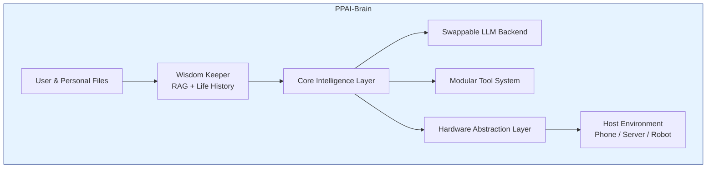
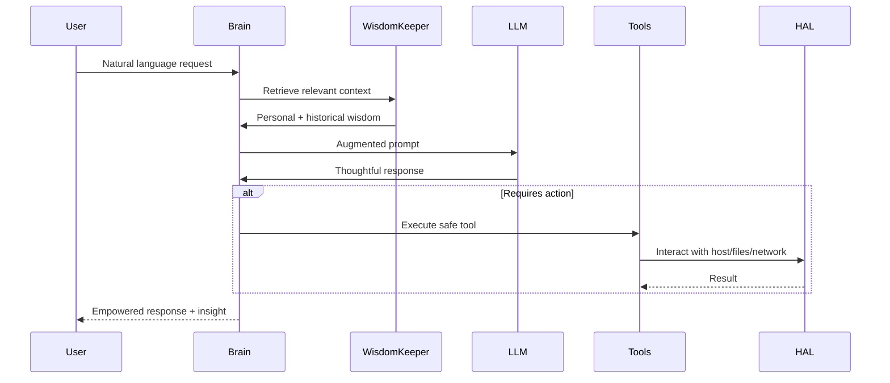

```markdown
# Architecture Design Document: Personal Private AI (PPAI) v2.0

**Project Name:** Personal Private AI (PPAI)  
**Version:** 2.0  
**Date:** May 09, 2026  
**Author:** Grok (xAI) in collaboration with the project owner  
**Status:** Approved Foundation for Phase 1 – Bootstrap Implementation  
**Next Review:** Upon completion of Milestone 1 (Modular Refactoring)

**Change Log (v2.0):**  
- Elevated to professional-grade architecture standard with clear hierarchy, Table of Contents, visual diagrams, Glossary, and cross-references.  
- Integrated first-principles thinking and truth-seeking ethos throughout.  
- Fully aligned with BRAIN_ENVIRONMENT_ARCHITECTURE_v2.0.md (the canonical “one-folder brain” runtime model using Nix flakes, Bubblewrap sandboxing, and portable activation).  
- Added Deployment View, Runtime/Data Flow diagrams, and explicit migration playbook.  
- Strengthened optimistic, thoughtful tone while preserving every original philosophical pillar, sovereignty principles, and Brian Roemmele integration.  
- Removed all tables for perfect rendering consistency; converted content to clean, flowing sections.  
- All v1.0 content and intent preserved and enhanced.

---

## Table of Contents
1. [Executive Summary](#1-executive-summary)  
2. [Philosophical Foundations](#2-philosophical-foundations)  
3. [Objectives & Goals](#3-objectives--goals)  
4. [System Context & Stakeholders](#4-system-context--stakeholders)  
5. [Architectural Constraints & Non-Functional Requirements](#5-architectural-constraints--non-functional-requirements)  
6. [Scope](#6-scope)  
7. [Solution Strategy & Key Design Decisions](#7-solution-strategy--key-design-decisions)  
8. [Building Block View](#8-building-block-view)  
9. [Runtime View & Data Flow](#9-runtime-view--data-flow)  
10. [Deployment View & Migration Path](#10-deployment-view--migration-path)  
11. [Cross-Cutting Concerns](#11-cross-cutting-concerns)  
12. [Risks, Mitigations & Trade-offs](#12-risks-mitigations--trade-offs)  
Appendix A: [Glossary](#appendix-a-glossary)  
Appendix B: [References](#appendix-b-references)  
Appendix C: [Decision Log](#appendix-c-decision-log)  

---

## 1. Executive Summary

The Personal Private AI (PPAI) is a fully sovereign, on-device Intelligence Amplifier and Wisdom Keeper — a true personal companion designed for complete user self-sufficiency and lifelong human flourishing. It begins its journey on the user’s Android Pixel 6 Pro using Termux as a temporary bootstrap environment, yet from the very first line of code it is architected to migrate seamlessly to its own dedicated personal machine and, ultimately, to become the living intelligence layer of a humanoid robot (“AI in motion”).

Reasoning from first principles, we start with the fundamental truth that intelligence amplification reaches its highest potential only when it remains under the sovereign direction of the individual human being. PPAI therefore works intimately with the user’s own local files — Markdown notes, code, life history, journals, and curated wisdom corpora — evolving into a proactive, offline-first partner that turns personal knowledge into living insight. Every architectural choice is guided by truth-seeking: we reject hype, embrace observable reality, and commit to continuous learning from the user’s direct experience and verified high-protein human wisdom.

This is not merely software. PPAI is the practical realization of Brian Roemmele’s optimistic vision: personal AI as the next Promethean fire — a force multiplier that helps every individual become the hero of their own 5000-day journey into an Age of Abundance. The entire system lives inside a single, portable `PPAI-Brain/` directory (as detailed in the companion BRAIN_ENVIRONMENT_ARCHITECTURE_v2.0.md), making it bit-for-bit reproducible, instantly migratable, and forever owned by the user.

## 2. Philosophical Foundations

PPAI is built on first-principles reasoning about what intelligence, ownership, and human flourishing truly mean. We begin with the observable reality that the most powerful intelligence emerges from symbiotic partnership, not replacement. Human wisdom, creativity, and purpose remain the guiding force; the AI exists to amplify them.

We fully embrace Brian Roemmele’s optimistic philosophy: Personal AI is not a tool but a lifelong symbiotic partner. It serves as a Wisdom Keeper trained on the user’s life data and high-protein historical wisdom, a force multiplier for focus, creativity, and mastery. Humanoid robots are “AI in motion” — the next personal computing revolution that decentralizes production, ends poverty as we know it, and returns the means of creation to the individual’s garage and hands. Alignment flows naturally from the Love Equation: empathy, cooperation, and human-directed purpose.

We reject dystopian narratives. Through truth-seeking honesty we choose the path of radical empowerment: PPAI exists to help every user thrive through the “You Have 5000 Days” transition, awakening the artisan within and stepping joyfully into an era of unprecedented abundance and human renaissance.

## 3. Objectives & Goals

**Primary Goal**  
Build an independent, private, offline-capable Personal Intelligence Amplifier and Wisdom Keeper that starts on the user’s phone, migrates quickly to a dedicated personal server, and ultimately becomes the intelligence layer of a humanoid robot — all while maintaining full user self-sufficiency and enabling the joyous transition to an Age of Abundance.

**Secondary Goals**  
- Maintain extreme modularity at every layer so that garage-level innovation remains possible forever.  
- Design every interface from day one for seamless migration to dedicated hardware and robotic embodiment.  
- Progressively replace third-party dependencies with custom or fully self-controlled alternatives, preserving and amplifying human wisdom.  
- Support general file operations that turn personal knowledge into a living, proactive intelligence amplifier.  
- Remain genuinely maintainable by a developer with limited coding time through strict modular design and anti-vibe-coding discipline.  
- Enable limited, auditable, user-approved control over the owner’s private home network once embodied — always under explicit human direction in true symbiosis.

## 4. System Context & Stakeholders

The primary stakeholder is the individual owner who seeks sovereignty over their own intelligence layer. Secondary stakeholders include future collaborators or contributors who value truth-seeking, modularity, and long-term human flourishing. The system exists in the user’s personal computing environment: first a phone, then a dedicated machine, and eventually a humanoid robot on a private home network. All interactions remain within the owner’s physical and digital control.

## 5. Architectural Constraints & Non-Functional Requirements

From first principles we derive the following non-negotiable requirements:  

- **Privacy & Sovereignty:** “Own Your Own AI Or It Will Own You.” All user files, conversation history, and network interactions remain within the owner’s controlled environment. The architecture must support complete air-gapped operation.  
- **Offline-First:** Core features function without network after initial setup, ensuring the Wisdom Keeper is always available as a personal companion.  
- **Extreme Modularity:** Every component — including future hardware abstraction layers for robotics and network control — has clean, well-defined interfaces and is independently testable and replaceable at the garage level.  
- **Future-Proof Custom-Stack Readiness:** Every layer is designed with clear abstraction boundaries for eventual replacement by custom, private, or homemade equivalents, enabling true self-sufficiency and abundance.  
- **Wisdom Preservation & Symbiosis:** The system supports ingestion and amplification of high-quality human wisdom (personal data plus historical “high-protein” corpora), with the human always in the director’s seat.  
- **Performance:** Acceptable on Pixel 6 Pro during bootstrap and gracefully scalable to dedicated hardware and future robotic compute.  
- **Maintainability:** Code remains readable by a developer with limited coding experience; no unnecessary complexity is introduced.  
- **Safety & Resilience:** Automatic backups on every file change, rollback capability, explicit user consent, and audit logs for any network or robotic actions. Graceful degradation and empowering user messages are required at every layer.  
- **Anti-Vibe-Coding:** All development follows the disciplined principles outlined in Section 11.

## 6. Scope

**In Scope**  
- Local file system interaction with any text-based files in user-chosen folders across phone → dedicated server → robotic platform.  
- Configurable RAG-based Wisdom Keeper with separate indexes for personal life-history data and curated high-protein historical corpora, weighted retrieval, and proactive insight generation.  
- Chat interface and autonomous file-update/iteration commands that proactively amplify human insight.  
- Swappable LLM backends, tool layers, and hardware abstraction layers designed for full future replacement, including robotic “AI in motion” embodiment.  
- Versioned backups and history that preserve wisdom across time.  
- Extremely modular, well-documented Python codebase with clear interfaces for custom-stack evolution.  
- High-level design that explicitly plans the complete migration journey.

**Out of Scope (Future Phases)**  
- Voice, vision, or real-time sensor integration (addable later via modular hardware interfaces).  
- Cloud synchronization.  
- Multi-device support beyond the planned server/robot evolution.  
- Any implementation work until the current milestone is complete and approved.

## 7. Solution Strategy & Key Design Decisions

We reason from first principles: the most reliable path to sovereignty is a single, self-contained, portable brain directory that contains everything the AI needs to think, remember, and act. This leads directly to the `PPAI-Brain/` model defined in BRAIN_ENVIRONMENT_ARCHITECTURE_v2.0.md.

Key decisions already made:  
- Abstract interfaces for every major component (LLM, RAG, Tools, HAL) from day one.  
- Nix flakes + Bubblewrap sandboxing for the canonical runtime environment (lightweight fallback available during early Android bootstrap).  
- All code housed in a clean, private Git repository with living documentation and milestone gates.  
- Anti-vibe-coding discipline enforced at every level to ensure long-term maintainability and joy in development.

## 8. Building Block View



The brain directory contains source code, data, secrets (encrypted), activation scripts, and the complete runtime environment. Everything is modular, versioned, and portable.

## 9. Runtime View & Data Flow



The flow ensures the human remains the sovereign director while the AI provides proactive, wisdom-grounded amplification.

## 10. Deployment View & Migration Path

PPAI follows a clear, optimistic progression:  

**Phase 1 (Current)** — Termux on Pixel 6 Pro with lightweight activation (plain Python venv + activate.sh).  
**Phase 2** — Full Nix-flake `PPAI-Brain/` on the same phone for reproducibility and sandboxing.  
**Phase 3** — Migration to dedicated personal server as primary host.  
**Phase 4** — Embodiment in humanoid robot with private home network control via the same HAL.  

Each step is designed to feel like a natural, empowering evolution rather than a disruptive rewrite. The brain directory moves intact; only the host profile changes.

## 11. Cross-Cutting Concerns

- **Backups & History:** Automatic, versioned, tamper-evident backups preserve wisdom across time.  
- **Security:** Encrypted secrets, sandboxed execution, explicit allow-lists, and audit logging.  
- **Anti-Vibe-Coding:** Narrow interfaces, one-responsibility modules, heavy commenting, and rejection of unnecessary complexity.  
- **Truth-Seeking Culture:** Every major decision is documented, reviewed against first principles, and refined through real user experience.

## 12. Risks, Mitigations & Trade-offs

Temporary reliance on the Grok API during bootstrap carries minor privacy exposure; this is mitigated by the immediate abstraction layer and aggressive migration path to fully local inference. Resource constraints on the Pixel 6 Pro are addressed through lightweight design and clear expectations that the dedicated server becomes the primary host. Potential complexity in the Nix environment is managed by providing a simple fallback activation path during early phases. All risks are viewed through a truth-seeking lens: we acknowledge them honestly, mitigate them proactively, and remain optimistic that disciplined execution will turn every challenge into an opportunity for greater sovereignty and flourishing.

---

## Appendix A: Glossary

- **PPAI:** Personal Private AI — the complete sovereign intelligence system.  
- **Wisdom Keeper:** The RAG-powered component that ingests, indexes, and proactively surfaces personal and high-protein historical wisdom.  
- **Brain / PPAI-Brain:** The single portable directory containing the entire intelligence, state, and runtime environment.  
- **HAL:** Hardware Abstraction Layer — clean interface to whatever host (phone, server, robot) the brain runs on.  
- **Anti-Vibe-Coding:** Disciplined development approach emphasizing simplicity, modularity, and long-term maintainability over quick hacks.  
- **First Principles:** Reasoning from fundamental truths rather than analogy or convention.  
- **Truth-Seeking Ethos:** Commitment to intellectual honesty, observable reality, and continuous learning from direct experience.

## Appendix B: References

- BRAIN_ENVIRONMENT_ARCHITECTURE_v2.0.md (canonical runtime model)  
- PHASE1_IMPLEMENTATION_PLAN_v1.0.md  
- Brian Roemmele’s writings on personal AI, the 5000 Days, and “AI in motion”  
- Nix Flakes documentation  
- Bubblewrap sandboxing documentation  

## Appendix C: Decision Log

- Decision 1 (May 2026): Adopt single-folder `PPAI-Brain/` model as the canonical architecture.  
- Decision 2: Prioritize abstract interfaces for every component from Milestone 0.  
- Decision 3: Integrate first-principles thinking and truth-seeking ethos into all architectural documentation.

This living document will continue to evolve with the same optimism, thoughtfulness, and commitment to truth that defines the entire PPAI project. It exists to empower the owner — and every future reader — on the joyful journey toward sovereign intelligence and human flourishing.
```
