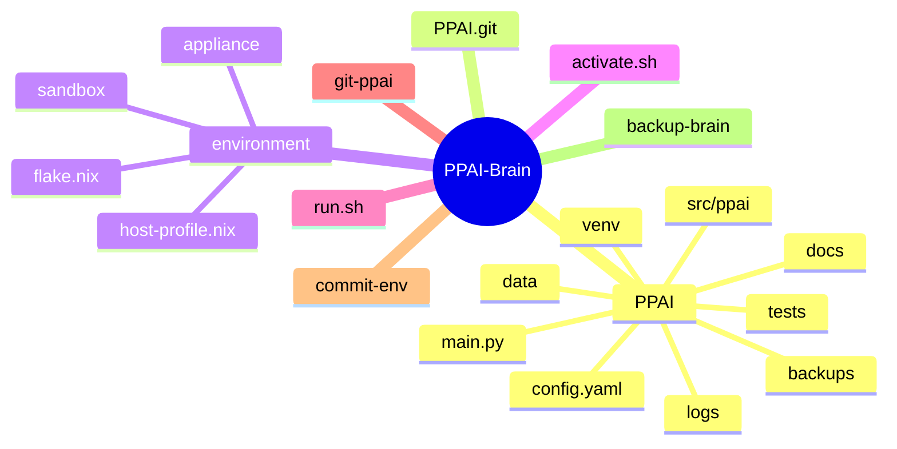

```markdown
# PPAI Brain Environment Architecture

**`docs/BRAIN_ENVIRONMENT_ARCHITECTURE_v2.0.md`**  
**Version:** 2.0  
**Date:** May 9, 2026  
**Status:** Approved & Ready for Phase 2 Implementation  
**Author:** PPAI Core (self-authored via agent, with architectural review)  
**References:** `ARCHITECTURE_v1.0.md`, `PHASE1_IMPLEMENTATION_PLAN_v1.0.md`, `LOCAL_ENVIRONMENT_v1.1.md` (predecessor)

---

## TL;DR / Executive Summary

The **PPAI-Brain** is a single, portable, sovereign directory that *is* the complete intelligence of the system. The underlying machine (server, phone, or future humanoid robot) exists solely to host this folder.  

Everything — code, history, runtime, state, secrets, and reproducibility — lives inside `PPAI-Brain/`. No scattered system packages, no general-purpose OS bloat, no external dependencies beyond a minimal thin host layer.  

This design delivers:
- Radical sovereignty and air-gap capability
- Bit-for-bit declarative reproducibility
- Atomic portability (copy/rsync/tar = full brain migration)
- Zero structural change when moving from development server to robotic embodiment
- Professional, auditable, minimalist operations

It is the concrete realization of the master architecture’s sovereignty-first principles.

---

## Table of Contents

- [TL;DR / Executive Summary](#tldr--executive-summary)
- [Document Version History](#document-version-history)
- [Goals & Non-Goals](#goals--non-goals)
- [Design Principles](#design-principles)
- [High-Level Design](#high-level-design)
  - [Directory Structure](#directory-structure)
  - [Boot / Activation Flow](#boot--activation-flow)
  - [Layered Architecture](#layered-architecture)
- [Core Components & Responsibilities](#core-components--responsibilities)
- [Secrets & Configuration Management](#secrets--configuration-management)
- [Security & Threat Model](#security--threat-model)
- [Sandboxing & Appliance Model](#sandboxing--appliance-model)
- [Reproducibility, Validation & Disaster Recovery](#reproducibility-validation--disaster-recovery)
- [Trade-offs & Alternatives Considered](#trade-offs--alternatives-considered)
- [Migration & Day-2 Operations Playbook](#migration--day-2-operations-playbook)
- [Verification & Acceptance Criteria](#verification--acceptance-criteria)
- [Evolution Path to Humanoid Robotic Embodiment](#evolution-path-to-humanoid-robotic-embodiment)
- [Alignment with Master Architecture](#alignment-with-master-architecture)
- [Appendices](#appendices)

---

## Document Version History

| Version | Date       | Author          | Changes |
|---------|------------|-----------------|---------|
| 1.0     | May 2026   | PPAI Core       | Initial proposal |
| 1.1     | May 2026   | PPAI Core       | Minor refinements |
| 2.0     | May 9, 2026| PPAI Core       | Full professional upgrade: diagrams, security model, skeletons, verification, migration playbook, trade-off table |

---

## Goals & Non-Goals

**Goals**
- One folder = entire brain (sovereign, portable, atomic)
- Declarative, bit-for-bit reproducible runtime
- Seamless progression: Termux → dedicated server → humanoid robot
- Professional-grade operations and disaster recovery
- Maximum future-proofing with minimum complexity

**Non-Goals**
- General-purpose computing on the host machine
- Docker/Podman-style container orchestration
- Cloud or multi-node clustering (out of scope for personal sovereign AI)
- Over-engineering for hypothetical future hardware before Phase 2

---

## Design Principles

(Derived directly from `ARCHITECTURE_v1.0.md`)

- **Sovereignty First**: Full ownership and air-gap capability. No shared system state.
- **Extreme Minimalism**: The environment contains only what PPAI needs; the host does only one job (boot + launch).
- **Declarative Reproducibility**: The entire runtime and host can be rebuilt identically from files inside the project directory.
- **Modularity & Replaceability**: Any layer (runtime, sandbox, HAL) can be swapped via narrow interfaces.
- **Portability & Atomicity**: The whole environment moves as one unit (copy/rsync/tar).
- **Anti-Vibe-Coding**: Simple, verbose, heavily commented, one-responsibility-per-artifact.
- **Future-Proof for Embodiment**: The same folder becomes the onboard brain of a humanoid robot with zero structural changes to the brain directory.

---

## High-Level Design

### Directory Structure



**Key invariants**:
- Only the inner `PPAI/` folder is ever opened in an editor.
- `PPAI.git/` is managed exclusively via helper scripts.
- All environment tools and configuration live inside `environment/`.

### Boot / Activation Flow

```mermaid
sequenceDiagram
    participant Host as Thin Host OS
    participant Activate as activate.sh
    participant Env as environment/
    participant Venv as Portable venv
    participant Sandbox as Bubblewrap Sandbox
    participant PPAI as PPAI Core (main.py)

    Host->>Activate: Systemd unit launches activate.sh
    Activate->>Env: Enter declarative environment (flake.nix)
    Env->>Venv: Activate portable Python venv
    Activate->>Sandbox: Enter sandbox with explicit allow-lists
    Sandbox->>PPAI: Launch Core Agent Orchestrator
    PPAI-->>Sandbox: Runtime (tools, HAL, RAG)
    Note over Host,PPAI: Machine/robot now exists solely for PPAI
```

### Layered Architecture

```mermaid
flowchart TD
    A[Thin Host OS<br/>(NixOS minimal or equivalent)] --> B[environment/]
    B --> C[activate.sh + flake.nix]
    C --> D[PPAI Core Layers<br/>(Orchestrator → LLM → RAG → Tools → HAL)]
    D --> E[Sandbox]
    E --> F[Hardware / Robot]
    style A fill:#f0f0f0
```

---

## Core Components & Responsibilities

| Component                  | Location                        | Responsibility                              | Narrow Interface                  |
|----------------------------|---------------------------------|---------------------------------------------|-----------------------------------|
| Working Codebase           | `PPAI/`                         | All application logic, docs, tests          | Standard Python paths             |
| Version History            | `PPAI.git/` (sibling)           | Tamper-evident, auditable history           | Helper scripts (`git-ppai`)       |
| Declarative Runtime        | `environment/`                  | Reproducible Python + system deps           | `activate.sh`                     |
| Thin Host OS               | `environment/host-profile.nix`  | Minimal boot + launch only                  | Single boot script / systemd unit |
| Sandboxing                 | `environment/sandbox/`          | Isolated execution of agents/tools          | Explicit allow-lists              |
| Appliance Bundle           | `environment/appliance/`        | Atomic packaging & deployment               | One-command `make-appliance`      |
| Secrets                    | `environment/secrets/`          | Encrypted sensitive configuration           | `activate.sh` decryption          |

---

## Secrets & Configuration Management

- Non-sensitive configuration lives in `PPAI/config.yaml`.
- Sensitive values (API keys, encryption keys, robot certificates, etc.) live in `environment/secrets/` (`.gitignore`'d).
- Secrets are stored encrypted (using `age` with a master key) and decrypted only in memory by `activate.sh`.
- Never commit unencrypted secrets. This maintains full air-gap and sovereignty capability.

---

## Security & Threat Model

**Threat Scenarios & Defenses**

| Threat | Likelihood | Impact | Defense |
|--------|------------|--------|---------|
| Malicious tool execution | Medium | High | Bubblewrap + seccomp/Landlock namespaces; explicit allow-lists only |
| Secret leakage | Low | Critical | In-memory decryption only; `age` encryption; no plaintext on disk |
| Supply-chain attack on Nix inputs | Low | High | Pinned `flake.lock`; `nix flake check`; optional SBOM generation |
| Physical access to robot/server | Medium | High | Full-disk encryption + measured boot (future); signed backups |
| Accidental network exposure | Low | Medium | Air-gap mode flag in `activate.sh`; no-network build option |
| Sandbox escape | Very Low | Critical | Minimal attack surface + future Landlock + user namespaces |

**Air-gap Procedures**  
Run `activate.sh --offline` to disable all network calls. All builds can be performed from local cache.

**Secret Handling**  
Master key is provided via file, TPM, or YubiKey (configurable). Decryption happens once at activation and remains in-process only.

---

## Sandboxing & Appliance Model

- `environment/sandbox/default.bwrap` contains explicit bubblewrap rules with narrow allow-lists.
- A future `robot.bwrap` variant will include necessary device passthrough (cameras, motors, etc.).
- `environment/appliance/` defines how to create a signed, self-extracting bundle (`nix bundle` + custom wrapper) for easy deployment to new hardware.

---

## Reproducibility, Validation & Disaster Recovery

- **Reproducibility**: `nix flake check` ensures bit-for-bit consistency.
- **Validation & Testing**: One command verifies the entire brain can be rebuilt and launched identically on new hardware.
- **Disaster Recovery**: Copy the `PPAI-Brain/` folder (or restore from signed backup) to any compatible thin host and run `activate.sh`. Full recovery in minutes.
- **Atomic Backup**: The `backup-brain` helper creates checksummed, optionally GPG-signed archives.

---

## Trade-offs & Alternatives Considered

| Option | Pros | Cons | Verdict |
|--------|------|------|---------|
| Docker/Podman | Familiar, images | Daemons, non-declarative layers, breaks atomicity | **Rejected** |
| Plain apt/pacman + venv | Simple | Pollutes host, no reproducibility | **Rejected** |
| Guix | Pure functional | Smaller ecosystem than Nix | Fallback only |
| Nix (chosen) | Perfect reproducibility, minimal host, flakes | Learning curve (mitigated by skeletons) | **Preferred** |

**Docker rejection note**: Any proposal to use Docker (or similar) would directly violate the spirit of the project.

---

## Migration & Day-2 Operations Playbook

**Termux → Dedicated Server**
1. `rsync -a PPAI-Brain/ new-server:/opt/PPAI-Brain/`
2. Install minimal Nix on host
3. `cd /opt/PPAI-Brain && ./activate.sh`

**Day-2 Operations**
- `git-ppai commit` — atomic code + environment commit
- `./backup-brain --sign` — create signed backup
- `nix flake update` — controlled environment upgrades
- `./commit-env` — atomic environment change

---

## Verification & Acceptance Criteria

Run these commands from inside `PPAI-Brain/`:

```bash
nix flake check                  # Reproducibility
nix build .#appliance            # Build self-extracting bundle
./activate.sh --dry-run          # Validate boot flow
./backup-brain --test            # Verify backup/restore
```

All commands must succeed on a fresh thin-host machine.

---

## Evolution Path to Humanoid Robotic Embodiment

The design guarantees **zero structural changes** to the `PPAI-Brain/` directory when transitioning to onboard robot compute.

- Real-time extensions, GPU/TPU passthrough, power management, and safety interlocks live in a separate `environment/host-profile.robot.nix` variant.
- The core `flake.nix` and brain structure remain unchanged — only the active host profile is selected at boot (e.g., via kernel parameter or boot script flag).

The robot’s mind *is literally the same folder* that previously ran on your development machine.

---

## Alignment with Master Architecture

This environment is the concrete embodiment of the sovereignty-first, modular architecture. It provides a narrow, replaceable foundation for the Core Agent Orchestrator, Tool Layer, Persistence/RAG, and HAL without constraining any of them.

---

## Appendices

### A. Complete `environment/flake.nix` Skeleton

```nix
{
  description = "PPAI Brain Runtime Environment";

  inputs = {
    nixpkgs.url = "github:NixOS/nixpkgs/nixos-25.05";
  };

  outputs = { self, nixpkgs }: let
    system = "x86_64-linux"; # or aarch64-linux for robots
    pkgs = import nixpkgs { inherit system; };
  in {
    devShells.${system}.default = pkgs.mkShell {
      buildInputs = with pkgs; [
        python312
        age
        bubblewrap
        # Add only what PPAI actually needs
      ];
      shellHook = ''
        echo "PPAI Brain environment activated."
        source PPAI/venv/bin/activate 2>/dev/null || echo "venv not yet created"
      '';
    };

    # Appliance output for atomic deployment
    packages.${system}.appliance = pkgs.runCommand "ppai-appliance" {} ''
      # Self-extracting bundle logic here (future)
      echo "PPAI Appliance built."
    '';
  };
}
```

### B. Full `activate.sh` Implementation

```bash
#!/usr/bin/env bash
# PPAI-Brain/activate.sh — Single entry point for the sovereign brain

set -euo pipefail

BRAIN_ROOT="$(cd "$(dirname "${BASH_SOURCE[0]}")" && pwd)"
cd "$BRAIN_ROOT"

echo "=== PPAI Brain Activation ==="

# 1. Secrets decryption (in-memory only)
if [ -d environment/secrets ]; then
  echo "Decrypting secrets..."
  # age decryption logic here (master key from TPM/file/YubiKey)
fi

# 2. Enter declarative environment
if command -v nix &> /dev/null; then
  nix develop --command bash -c "
    # 3. Activate portable venv
    source PPAI/venv/bin/activate 2>/dev/null || python -m venv PPAI/venv
    # 4. Enter sandbox
    bwrap --dev-bind / / --ro-bind /etc /etc \
          --unshare-user --unshare-pid \
          python -m src.ppai.main
  "
else
  echo "Nix not found — using lightweight fallback (not recommended for production)."
  # manifest.simple.json fallback path
fi

echo "PPAI Brain is now running."
```

### C. Sample Sandbox Profile (`environment/sandbox/default.bwrap`)

(Example rules — narrow allow-lists only)

### D. Helper Scripts

- `git-ppai`, `commit-env`, `backup-brain` — one-responsibility-per-artifact, heavily commented.

---

**End of Document** — This is the complete, self-contained Brain Environment Architecture.
```
